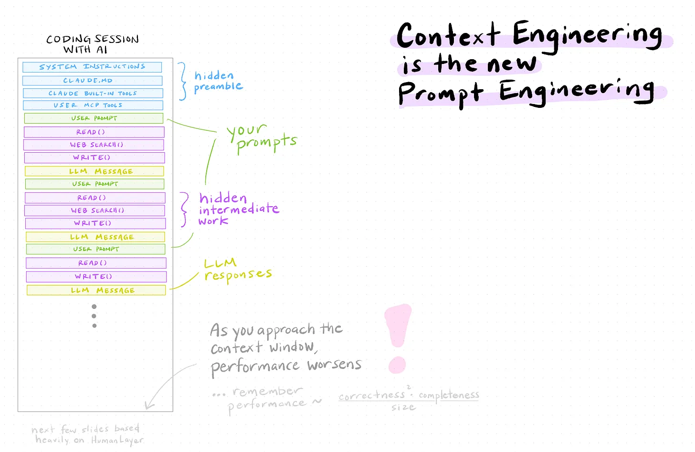

## {.plain}

\begin{center}
\vspace{2.0cm}
{\rmfamily\bfseries\Huge Claude Code is\\research infrastructure,\\not autocomplete.}
\end{center}

## Three threads today

\vspace{0.4em}

\begin{enumerate}
  \item How it works.
  \item How I use it.
  \item What to watch for.
\end{enumerate}

\vspace{0.6em}

\small Then group activities.

# How it works

## An LLM chat is one long prompt that grows with every turn

\begin{center}
\includegraphics[width=0.7\textwidth, height=0.6\textheight, keepaspectratio]{figures/llm-anatomy.png}
\end{center}

\vspace{0.2em}

\footnotesize\color{wehiGrey70} A token is a subword piece — about three-quarters of a word, four characters on average. The context window is measured in tokens (Sonnet 4.6: 200K standard, 1M premium).

## Confident wrong answers are a feature of the architecture

Not looking up facts. Generating fluent text.

\vspace{0.5em}

Fluent and \textcolor{wehiOrange}{wrong} sound the same.

## The context window is the model's only memory

\begin{center}
\begin{tikzpicture}[
  font=\sffamily,
  buffer/.style={draw=wehiTealDark, very thick, fill=wehiTealTint, rounded corners=6pt},
  inItem/.style={font=\sffamily\small, anchor=west, text=wehiBlack},
  outItem/.style={font=\sffamily\small\itshape, text=wehiGrey50, anchor=west}
]
  \draw[buffer] (-6, -2.0) rectangle (-0.6, 1.9);
  \node[font=\sffamily\bfseries\small, anchor=north, text=wehiTealDark]
    at (-3.3, 1.75) {Context window  (this turn)};
  \node[inItem] at (-5.7, 0.85) {\textcolor{wehiTealDark}{\textbullet}\, file you opened};
  \node[inItem] at (-5.7, 0.20) {\textcolor{wehiTealDark}{\textbullet}\, error you pasted};
  \node[inItem] at (-5.7, -0.45){\textcolor{wehiTealDark}{\textbullet}\, tool result};
  \node[font=\sffamily\footnotesize\itshape, text=wehiGrey70, anchor=west]
    at (-5.7, -1.4) {= the model's only memory};

  \node[font=\sffamily\bfseries\small, text=wehiGrey70, anchor=north]
    at (2.7, 1.75) {Not in the buffer:};
  \node[outItem] at (0.5, 0.85) {previous session};
  \node[outItem] at (0.5, 0.20) {files you didn't open};
  \node[outItem] at (0.5, -0.45) {tool calls in other turns};
\end{tikzpicture}
\end{center}

\vspace{0.4em}

If it "forgot" — it never had it.

## Training data has a freshness date

\vspace{0.6em}

\begin{center}
\begin{tikzpicture}[
  font=\sffamily\small,
  axis/.style={->, thick, wehiBlack},
  cutoff/.style={wehiOrange, very thick, dashed},
  now/.style={wehiTealDark, very thick}
]
  \draw[axis] (-6, 0) -- (6.5, 0) node[right, font=\sffamily\footnotesize] {time};

  \draw[cutoff] (-1.5, -0.5) -- (-1.5, 1.6);
  \node[text=wehiOrange, anchor=south, font=\sffamily\bfseries\small]
    at (-1.5, 1.6) {Training cutoff};

  \draw[now] (3, -0.5) -- (3, 1.6);
  \node[text=wehiTealDark, anchor=south, font=\sffamily\bfseries\small]
    at (3, 1.6) {Today};

  \node[anchor=north, align=center] at (-4, -0.6) {seen during\\ training};
  \node[anchor=north, align=center] at (0.75, -0.6) {published after cutoff\\ \footnotesize\textit{$\to$ it guesses}};
  \node[anchor=north, align=center] at (5, -0.6) {your repo today\\ \footnotesize\textit{$\to$ never seen}};
\end{tikzpicture}
\end{center}

## Grounding is what turns guessing into reasoning

Show the actual file, the actual error, the actual data.

\vspace{0.6em}

What's in the buffer matters more than \textcolor{wehiOrange}{which model} you chose.

# Web chat to agentic

## In a web chat, you are the bridge between model and reality

You read code in. You copy answers out. You re-paste errors.

\vspace{0.6em}

The model has no hands. You are the hands.

\vspace{0.6em}

\small Fine for one-off questions. Does not scale to a workflow.

## An agent reads files, runs commands, loops on results

::: {.columns}

::: {.column width="50%"}
\begin{enumerate}
  \item \textbf{Think}
  \item \textbf{Act} — read, run, call.
  \item \textbf{Observe}
  \item Repeat.
\end{enumerate}
:::

::: {.column width="50%"}
\begin{block}{Can do unattended}
Read files, run shells, edit, web, MCP.
\end{block}

\begin{block}{Cannot do}
Know your goal unless you say it.
\end{block}
:::

:::

\vspace{0.4em}

\small More autonomy $=$ more chances to be \textcolor{wehiOrange}{wrong} unnoticed.

## MCP servers turn Claude into a research client

First-party, free:

\begin{itemize}
  \item \textbf{PubMed} — search, metadata, full text.
  \item \textbf{bioRxiv / medRxiv} — preprints by topic, author, funder.
  \item \textbf{Google Drive, Gmail, Calendar} — notes, drafts, scheduling.
\end{itemize}

\vspace{0.5em}

The lever that makes Claude useful for \textcolor{wehiOrange}{research}, not just code.

# How I actually use it

## TDD keeps the agent honest on the C9orf72 pipeline

\begin{enumerate}
  \item Plan mode — no code yet.
  \item Plan: target function, its tests, the simulation.
  \item Approve. Failing tests, then function, then green.
  \item Read every diff.
\end{enumerate}

## Plan first, execute second — every iteration

::: {.columns}

::: {.column width="50%"}
**Plan**

- Function?
- Inputs, outputs?
- Property preserved?
- Simulation that proves it?
:::

::: {.column width="50%"}
**Execute**

- Tests fail.
- Tests pass.
- Read the diff.
- Commit.
:::

:::

\vspace{0.4em}

\small A bug in a web app frustrates a user. A bug in my analysis ends up in a \textcolor{wehiOrange}{paper}.

## /capture, /meeting, /review make Claude a lab-notebook collaborator

\begin{itemize}
  \item \texttt{/capture} — thought, paper, fragment $\to$ structured note.
  \item \texttt{/meeting} — Zoom transcript $\to$ actions, decisions, follow-ups.
  \item \texttt{/review} — week's end $\to$ summary, what's stuck, next week.
\end{itemize}

\vspace{0.5em}

Not the author. The structure that lets me \textcolor{wehiOrange}{write more} of my own thinking down.

## Daily notes feed weekly reviews feed paper drafts

\vspace{0.4em}

\begin{center}
\begin{tikzpicture}[
  font=\sffamily\small,
  stage/.style={draw=wehiTealDark, fill=wehiTealTint, rounded corners=4pt,
                minimum width=3.4cm, minimum height=1.4cm, align=center},
  forward/.style={->, very thick, wehiTealDark},
  back/.style={->, thick, wehiGrey70, dashed}
]
  \node[stage] (d) at (0,   0) {Daily notes\\ \footnotesize 5×/week};
  \node[stage] (w) at (4.5, 0) {Weekly reviews\\ \footnotesize 1×/week};
  \node[stage] (p) at (9,   0) {Paper draft\\ \footnotesize sections};

  \draw[forward] (d) -- (w);
  \draw[forward] (w) -- (p);

  \draw[back] (w.north west) to[bend left=30] (d.north east);
  \node[text=wehiGrey70, font=\sffamily\footnotesize] at (2.25, 1.55)
    {Claude reads back};

  \draw[back] (p.north west) to[bend left=30] (w.north east);
  \node[text=wehiGrey70, font=\sffamily\footnotesize] at (6.75, 1.55)
    {Claude reads back};
\end{tikzpicture}
\end{center}

\vspace{0.4em}

\small Methods come from March's notes. Discussion comes from when it first surprised me.

# Context management

## Context is the bottleneck, not the model

::: {.columns}

::: {.column width="62%"}
{width=100%}
:::

::: {.column width="38%"}
\small
Near the limit, performance degrades.

\vspace{0.5em}

\textcolor{wehiOrange}{What} you put in beats how you phrase it.
:::

:::

## CLAUDE.md and skills give Claude durable memory

::: {.columns}

::: {.column width="50%"}
**CLAUDE.md** — always loaded.

- Conventions
- Domain vocabulary
- Project anti-patterns
- Pointers to source-of-truth files
:::

::: {.column width="50%"}
**Skills / slash commands** — on demand.

- Reviewing a PR
- Bumping a package version
- Drafting a session log
:::

:::

## Sub-agents read; design docs persist; restart before drift

\vspace{0.4em}

\begin{center}
\begin{tikzpicture}[
  font=\sffamily\small,
  mainBox/.style={draw=wehiTealDark, very thick, fill=wehiTealTint, rounded corners=4pt,
                  minimum width=4.2cm, minimum height=1.5cm, align=center},
  subBox/.style={draw=wehiGrey50, dashed, fill=wehiGrey50!12, rounded corners=4pt,
                 minimum width=4.2cm, minimum height=1.5cm, align=center, text=wehiGrey70},
  arrow/.style={->, thick, wehiTealDark}
]
  \node[mainBox] (M1) at (-3.4,  1.4) {Main session\\ \footnotesize 8K tokens};
  \node[mainBox] (M2) at (-3.4, -1.4) {Main session\\ \footnotesize 9K tokens (+ summary)};
  \node[subBox]  (S)  at ( 3.4,  0)   {Sub-agent\\ \footnotesize 80K tokens — twenty files};

  \draw[arrow] (M1.east) to[bend left=12] node[midway, above, font=\sffamily\footnotesize, text=wehiTealDark, yshift=2pt] {spawn} (S.north west);
  \draw[arrow] (S.south west) to[bend left=12] node[midway, below, font=\sffamily\footnotesize, text=wehiTealDark, yshift=-2pt] {summary} (M2.east);

  \node[anchor=west, text=wehiGrey70, font=\sffamily\footnotesize\itshape]
    at (S.east) {\,then dies};
\end{tikzpicture}
\end{center}

\vspace{0.5em}

\small Design docs survive sessions. Repeating corrected mistakes $=$ drift — restart, reload.

# Verification

## Git is Claude's other memory — and your safety net

\begin{itemize}
  \item \textbf{Rollback is cheap.} \texttt{git reset} undoes nonsense.
  \item \textbf{Memory is auditable.} "What changed in the last three commits?" — concrete, not guessed.
\end{itemize}

\vspace{0.6em}

Commit early, commit often.

## Read the diff, every time

\begin{itemize}
  \item Code $\to$ run the test, quote the output.
  \item Data $\to$ row counts, dtypes, NA rates, before / after.
  \item Plot $\to$ render it. Look at it.
  \item Model $\to$ predicted vs.\ actual.
\end{itemize}

\vspace{0.6em}

"It should work" is \textcolor{wehiOrange}{not} verification.

## Simulate with a known truth; check it's recovered

For any step that feeds a figure or a table:

\vspace{0.4em}

\begin{enumerate}
  \item Generate data with known ground truth.
  \item Run the pipeline.
  \item Confirm it recovers the truth within tolerance.
\end{enumerate}

\vspace{0.5em}

\small Substitute for cross-software replication. The simulation \emph{is} the test fixture.

## When it's confused, re-ground — don't argue

\vspace{0.3em}

\begin{center}
\begin{tikzpicture}[
  font=\sffamily\small,
  vague/.style={draw=wehiGrey70, fill=wehiGrey50!12, rounded corners=4pt,
                minimum width=5.6cm, minimum height=2.1cm, align=center, inner sep=6pt},
  grounded/.style={draw=wehiTealDark, fill=wehiTealTint, rounded corners=4pt,
                   minimum width=5.6cm, minimum height=2.1cm, align=center, inner sep=6pt},
  arrow/.style={->, thick, wehiGrey70}
]
  \node[vague]    (UP) at (-3.2,  1.5) {\textbf{Vague prompt}\\ \small ``compare the two ancestries''};
  \node[grounded] (GP) at ( 3.2,  1.5) {\textbf{Grounded prompt}\\ \small ``compare gnomAD AFR vs EUR\\ in \texttt{/data/.../finemap/}''};

  \node[vague]    (UO) at (-3.2, -1.7) {\textbf{Plausible-looking wrong}\\ \small ``Northern vs Southern European…''\\ \footnotesize\textcolor{wehiOrange}{(silently swapped)}};
  \node[grounded] (GO) at ( 3.2, -1.7) {\textbf{Verifiable correct}\\ \small ``AFR ($n{=}8127$) vs EUR\\ ($n{=}\ldots$)…''};

  \draw[arrow] (UP) -- (UO);
  \draw[arrow, wehiTealDark] (GP) -- (GO);
\end{tikzpicture}
\end{center}

# Pitfalls

## Six ways this goes wrong

\vspace{0.4em}

\begin{center}
\resizebox{\textwidth}{!}{%
\begin{tikzpicture}[
  font=\sffamily\small,
  card/.style={draw=wehiTealDark, fill=wehiTealTint, rounded corners=4pt,
               minimum width=4.4cm, minimum height=1.7cm, align=center, inner sep=4pt}
]
  \node[card] at (0,    1.95) {\textbf{Premature action}\\ \footnotesize plan first};
  \node[card] at (4.7,  1.95) {\textbf{Confabulated paths}\\ \footnotesize verify by reading};
  \node[card] at (9.4,  1.95) {\textbf{Sycophancy}\\ \footnotesize it will agree if you push};
  \node[card] at (0,    0)    {\textbf{Cost runaway}\\ \footnotesize set a budget};
  \node[card] at (4.7,  0)    {\textbf{Over-reliance}\\ \footnotesize risky for students mid-training};
  \node[card] at (9.4,  0)    {\textbf{Vibe coding}\\ \footnotesize runs, but no one understands it};
\end{tikzpicture}}
\end{center}

# Lab policies

## Data egress is the binding constraint, not SSH topology

::: {.columns}

::: {.column width="50%"}
\textbf{Fine}

\begin{itemize}
  \item Code-only HPC repos
  \item Pipeline + simulation code
  \item Manuscript drafts (code-only dirs)
\end{itemize}
:::

::: {.column width="50%"}
\textbf{Not fine without policy}

\begin{itemize}
  \item UKB, GEL, clinical data
  \item Mixed code/data directories
  \item "It's on the HPC" as control
\end{itemize}
:::

:::

\vspace{0.4em}

\small Not \emph{where} the agent runs. \emph{What bytes leave the building}.

## Ask IT for an Enterprise tier and a deny-list

\begin{block}{Concrete ask}
\textbf{Enterprise tier} (zero data retention) $+$ a documented \textbf{deny-list} for controlled-access directories.
\end{block}

\vspace{0.6em}

Until then: laptops $\checkmark$, code-only HPC $\checkmark$, controlled data \textcolor{wehiOrange}{off-limits}.

# Where to start

## You all have access — try this Monday

\begin{block}{Three things this week}
\begin{enumerate}
  \item Open Claude Code in a real project. Propose a \texttt{CLAUDE.md}. Commit.
  \item One recurring task $\to$ slash command.
  \item Pick an activity from \texttt{ACTIVITIES.md}.
\end{enumerate}
\end{block}

\vspace{0.8em}

\begin{center}
\textbf{\large Claude Code is research infrastructure, not autocomplete.}
\end{center}
